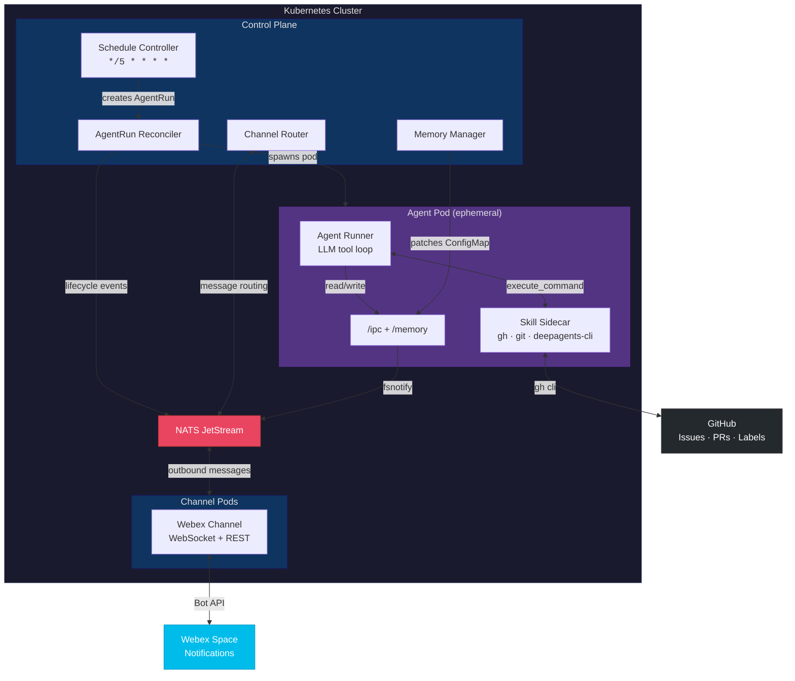
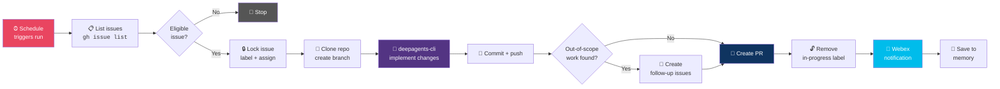
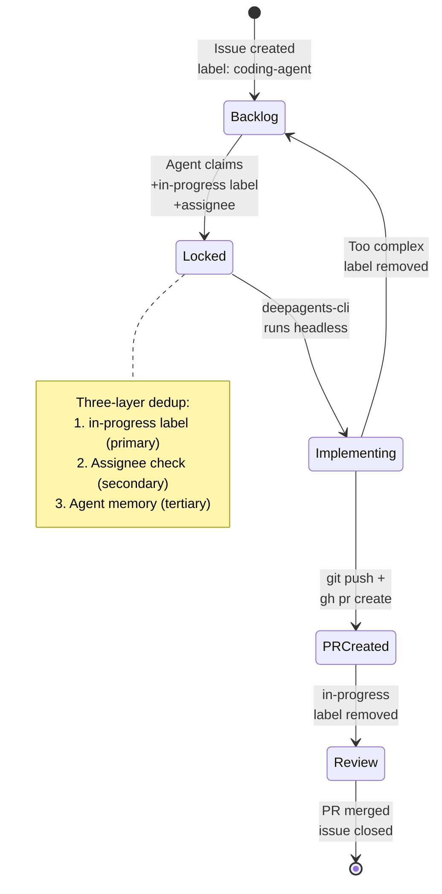
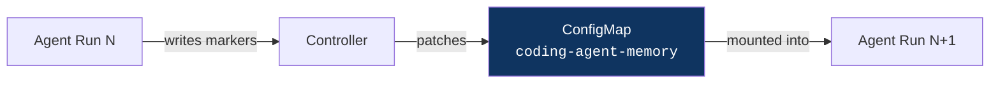
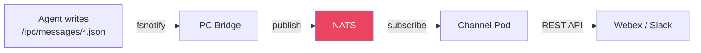
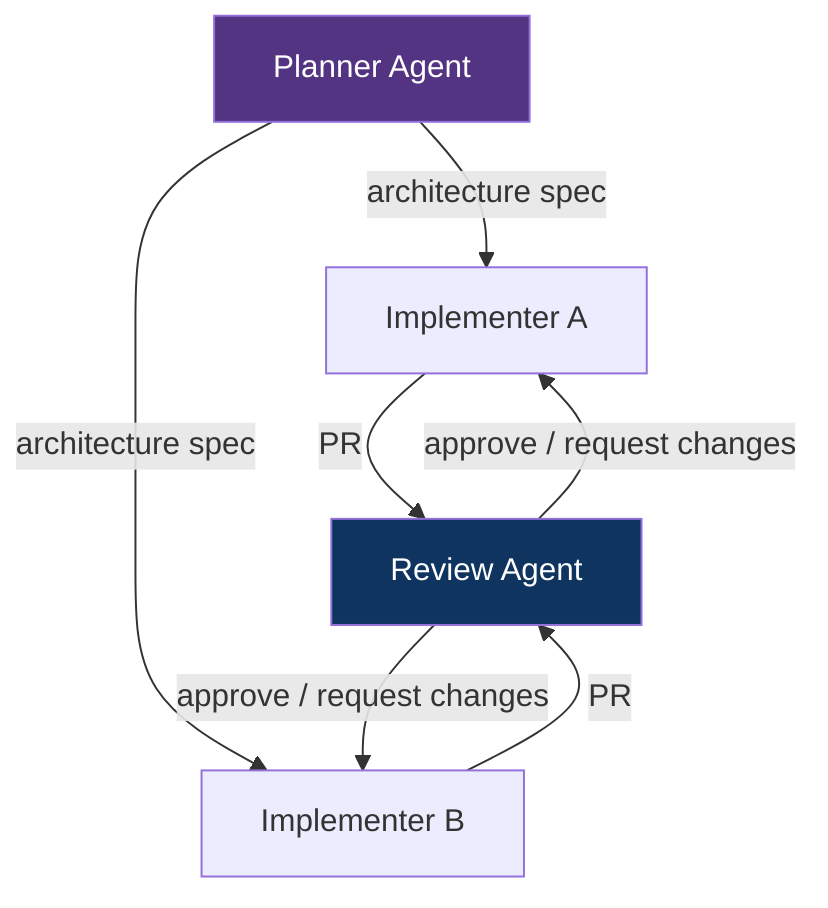

# Sympozium — Autonomous Software Engineering Platform

An architecture overview of the Sympozium-powered coding agent that autonomously picks up GitHub issues, implements changes, and delivers Pull Requests.

---

## System Architecture

---

## Coding Agent Flow

---

## Task Management Lifecycle

---

## Core Concepts

### Memory

Each agent instance has a **persistent ConfigMap** mounted at `/memory/MEMORY.md`. The controller extracts structured markers from agent output and patches the ConfigMap between runs.

Memory tracks completed issues, PR URLs, and lessons learned — preventing duplicate work across runs.

### Schedule

| Property | Value |
|----------|-------|
| Interval | `*/5 * * * *` (every 5 minutes) |
| Type | `sweep` |
| Concurrency | `Forbid` (no parallel runs) |
| Memory | Included in each run's context |

### Connectors

| Connector | Transport | Purpose |
|-----------|-----------|---------|
| **Webex** | WebSocket + REST API | PR notifications, status updates |
| **GitHub** | `gh` CLI in sidecar | Issue listing, assignment, PR creation |
| **Slack** | Socket Mode | Message routing (available) |

Communication flows through a filesystem-based IPC bridge:

### Supervisor

The **Controller Manager** acts as the platform supervisor:

- Watches CRDs (AgentRun, SympoziumInstance, SympoziumSchedule, PersonaPack, SkillPack)
- Spawns ephemeral agent pods as Kubernetes Jobs
- Routes messages between agents and channels
- Manages agent memory lifecycle
- Enforces policies via admission webhooks

Each agent pod is fully isolated — its own filesystem, network, and sidecar tools — and is destroyed after completion.

---

## Technology Stack

| Layer | Technology |
|-------|-----------|
| Orchestration | Kubernetes (CRDs + Controllers) |
| Event Bus | NATS JetStream |
| Agent Runtime | Go (agent-runner with LLM tool loop) |
| Code Implementation | `deepagents-cli` (Python, headless mode) |
| LLM Provider | Azure OpenAI (GPT-5.2) |
| Source Control | GitHub (`gh` CLI) |
| Notifications | Webex (Bot SDK + REST API) |
| IPC | Filesystem (fsnotify) → NATS |

---

## Future Improvements

### Multi-Agent Coordination

Currently each agent run is independent. Future work could enable agents to coordinate — one agent plans the architecture while another implements, with a third reviewing the PR.

### Spec-Driven Development
Instead of free-form issue descriptions, issues could contain structured specs (API contracts, test cases, acceptance criteria). The agent would validate its implementation against the spec before submitting, achieving higher first-pass success rates.

### Hierarchical Task Decomposition
A supervisor agent could break large issues into smaller, well-scoped sub-issues automatically — each implementable in a single run.

### Review Agent
A dedicated review persona could watch for new PRs, run tests, check for regressions, and either approve or request changes — closing the loop without human intervention.

### Learning from Feedback
When PRs are rejected or require changes, the agent could learn from review comments and store patterns in memory — improving code quality over successive runs.

### Cross-Repository Orchestration
Extend the agent to work across multiple repositories — updating an API server and its client SDK in coordinated PRs with compatible version bumps.
