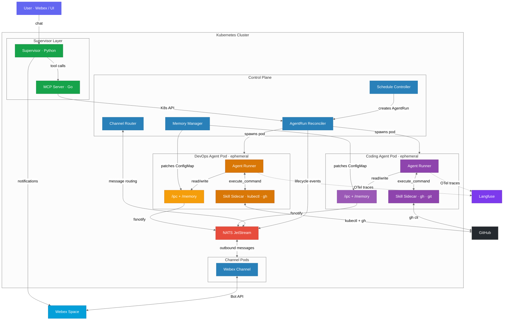
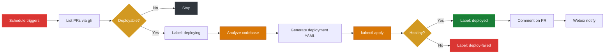
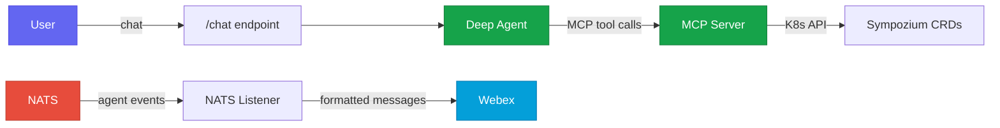
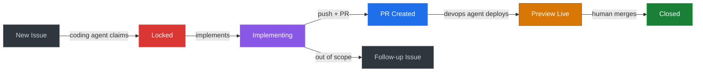
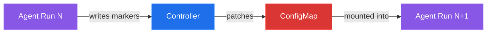
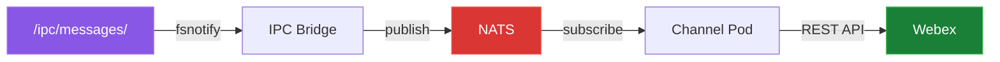

# Sympozium — Autonomous Software Engineering Platform

An architecture overview of the Sympozium-powered multi-agent system that autonomously implements GitHub issues, deploys preview environments, and orchestrates specialist agents — all running on Kubernetes.

---

## System Architecture

---

## Agents

The platform runs two specialist agents on recurring schedules, plus a supervisor for human interaction.

### Coding Agent

Picks up GitHub issues labeled `coding-agent`, implements changes, and opens Pull Requests. Runs every 5 minutes.

```mermaid
graph LR
    A["Schedule triggers"] --> B["List issues via gh"]
    B --> C{"Eligible?"}
    C -->|No| Stop["Stop"]
    C -->|Yes| D["Lock: label + assignee"]
    D --> E["Clone + branch"]
    E --> F["Implement changes"]
    F --> G["Commit + push"]
    G --> H{"Follow-ups?"}
    H -->|Yes| I["Create follow-up issues"]
    H -->|No| J["Create PR"]
    I --> J
    J --> K["Remove in-progress label"]
    K --> L["Webex notify"]

    style A fill:#da3633,stroke:#f85149,color:#fff
    style F fill:#8957e5,stroke:#a371f7,color:#fff
    style J fill:#1f6feb,stroke:#388bfd,color:#fff
    style L fill:#1a7f37,stroke:#3fb950,color:#fff
    style Stop fill:#30363d,stroke:#484f58,color:#c9d1d9
    style C fill:#d29922,stroke:#e3b341,color:#fff
    style H fill:#d29922,stroke:#e3b341,color:#fff
```

**Key behaviours:**

- GitHub is the **sole source of truth** — the agent queries `gh issue list` every run, never relying on memory for issue state
- Uses `read_file`, `write_file`, `list_directory`, and `execute_command` tools to understand the codebase and make changes
- Creates follow-up issues for out-of-scope work discovered during implementation
- Memory stores codebase learnings only (not issue state)

### DevOps Agent (PR Deployer)

Watches for PRs created by the coding agent and deploys them to preview environments in the Kubernetes cluster. Runs every 5 minutes.

**Deployment strategy** (no Docker required):

1. Creates a namespace `preview-<pr-number>`
2. Uses a Kubernetes **init container** (`alpine/git`) to clone the PR branch
3. Main container (e.g. `node:22-alpine`) installs dependencies and runs the app from a shared `emptyDir` volume
4. Exposes the app via a **NodePort** service
5. Comments the preview URL and `kubectl port-forward` instructions on the PR

**Label-based state machine** for PRs:

| Label | Meaning |
|-------|---------|
| _(none)_ | Ready for deployment |
| `deploying` | Another run is handling it |
| `deployed` | Successfully deployed |
| `deploy-failed` | Failed, needs manual attention |

### Supervisor

A Python deep agent (LangChain + Azure OpenAI) that provides a human-facing chat interface for the entire platform. Runs as a persistent deployment, not ephemeral.

**Components:**

- **MCP Server** (Go) — exposes all Sympozium CRD operations (list/get/create instances, runs, schedules, personas, skills, memory) as MCP tools over SSE. Auto-discovers resources across all Kubernetes namespaces.
- **Supervisor Agent** (Python) — connects to the MCP Server, answers questions about the platform, delegates tasks to specialist agents, and reports results.
- **NATS Listener** — subscribes to `agent.run.completed` and `agent.run.failed` events, formats them, and forwards to Webex. Skips agents that send their own notifications to avoid duplicates.
- **Chat Server** — Starlette app serving `/chat` and `/health` endpoints, proxied by the Sympozium UI.

**MCP Tools available to the supervisor:**

| Tool | Purpose |
|------|---------|
| `list_instances` / `get_instance` | Inspect deployed agents |
| `update_instance_model` | Change an agent's LLM model or provider |
| `list_agent_runs` / `get_agent_run` | Monitor task execution |
| `create_agent_run` | Delegate work to a specialist agent |
| `get_agent_run_logs` | Debug agent failures |
| `list_schedules` / `create_schedule` / `update_schedule` | Manage recurring tasks |
| `suspend_schedule` / `resume_schedule` / `delete_schedule` | Control agent activation |
| `list_persona_packs` / `enable_persona_pack` / `disable_persona_pack` | Manage agent bundles |
| `get_agent_memory` / `update_agent_memory` | Read/write agent knowledge |
| `list_skills` | Inspect available skill packs |

---

## Task Management Lifecycle

**End-to-end flow:**

1. A GitHub issue is created with the `coding-agent` label
2. Coding agent picks it up, locks it (`in-progress` + assignee), implements changes, opens a PR
3. DevOps agent detects the new PR, deploys it to a preview namespace, comments the URL on the PR
4. Both agents notify via Webex at each step
5. Human reviews the PR with a live preview, merges when satisfied

**Three-layer deduplication** prevents concurrent coding agent runs from claiming the same issue:

1. **`in-progress` label** — primary lock, added before work begins
2. **Assignee** — secondary signal, agent assigns itself via `gh issue edit --add-assignee @me`
3. **Open PR check** — tertiary signal, skips issues that already have a PR referencing them

---

## Core Concepts

### Memory

Each agent instance has a **persistent ConfigMap** mounted at `/memory/MEMORY.md`. The controller extracts structured markers from agent output and patches the ConfigMap between runs.

**Important:** Memory stores codebase learnings and deployment notes — **not** issue or PR state. GitHub is always the source of truth for task status.

### Schedules

| Agent | Interval | Type | Concurrency |
|-------|----------|------|-------------|
| Coding Agent | `*/5 * * * *` (every 5 min) | `heartbeat` | `Forbid` |
| DevOps Agent | `*/5 * * * *` (every 5 min) | `sweep` | `Forbid` |

Both schedules can be suspended/resumed via the supervisor or `kubectl`.

### IPC and Message Flow

Communication between agent pods and the control plane flows through a filesystem-based IPC bridge:

Agents write JSON files to `/ipc/messages/` to send Webex notifications, `/ipc/tools/` for sidecar command execution, and `/ipc/schedules/` for self-scheduling.

### GitHub Labels

Labels serve as the coordination mechanism between agents:

| Label | Used By | Purpose |
|-------|---------|---------|
| `coding-agent` | Coding Agent | Marks issues the agent should pick up |
| `in-progress` | Coding Agent | Lock — issue is being implemented |
| `follow-up` | Coding Agent | Auto-created issue from out-of-scope discovery |
| `deploying` | DevOps Agent | Lock — PR is being deployed |
| `deployed` | DevOps Agent | PR has a live preview environment |
| `deploy-failed` | DevOps Agent | Deployment failed, needs manual intervention |

### Observability

Agent runs are instrumented with **OpenTelemetry** and traces are sent to **Langfuse** for LLM observability:

- Every LLM call, tool invocation, and agent step is captured as a span
- Traces include token usage, latency, and tool parameters
- Langfuse provides dashboards for cost tracking, latency analysis, and debugging

---

## Technology Stack

| Layer | Technology |
|-------|-----------|
| Orchestration | Kubernetes (CRDs + Controllers) |
| Event Bus | NATS JetStream |
| Agent Runtime | Go (agent-runner with LLM tool loop) |
| Supervisor | Python (LangChain deep agents) |
| MCP Server | Go (mcp-go + controller-runtime) |
| LLM Provider | Azure OpenAI (GPT-5.2) |
| Source Control | GitHub (`gh` CLI) |
| Notifications | Webex (Bot SDK + REST API) |
| IPC | Filesystem (fsnotify) → NATS |
| Observability | OpenTelemetry → Langfuse |
| UI | React + TypeScript (Sympozium dashboard) |

---

## Kubernetes Resources

A fully deployed system creates these resources in the `sympozium-system` namespace:

| Resource | Kind | Purpose |
|----------|------|---------|
| `coding-agent` | SympoziumInstance | Coding agent identity + config |
| `devops-agent` | SympoziumInstance | DevOps agent identity + config |
| `coding-agent` | PersonaPack | Coding agent persona definition |
| `devops-agent` | PersonaPack | DevOps agent persona definition |
| `coding-agent` | SkillPack | gh + git sidecar |
| `devops-agent` | SkillPack | kubectl + gh sidecar |
| `coding-agent-heartbeat` | SympoziumSchedule | 5-min coding agent trigger |
| `devops-agent-sweep` | SympoziumSchedule | 5-min devops agent trigger |
| `coding-agent-memory` | ConfigMap | Persistent coding agent memory |
| `devops-agent-memory` | ConfigMap | Persistent devops agent memory |
| `sympozium-mcpserver` | Deployment | MCP Server for supervisor |
| `sympozium-supervisor` | Deployment | Supervisor deep agent + chat API |
| `sympozium-controller-manager` | Deployment | Control plane |
| `nats` | StatefulSet | NATS JetStream |

Each agent run creates an ephemeral pod (Kubernetes Job) in the same namespace, which is cleaned up after completion.

---

## Future Improvements

### Review Agent
A dedicated review persona that watches for new PRs, runs tests, checks for regressions, and either approves or requests changes — closing the loop without human intervention.

### Spec-Driven Development
Issues could contain structured specs (API contracts, test cases, acceptance criteria). The agent would validate its implementation against the spec before submitting, achieving higher first-pass success rates.

### Hierarchical Task Decomposition
The supervisor could break large issues into smaller, well-scoped sub-issues automatically — each implementable in a single coding agent run.

### Learning from Feedback
When PRs are rejected or require changes, the coding agent could learn from review comments and store patterns in memory — improving code quality over successive runs.

### Browser Tool Integration
Equip agents with a headless browser tool to interact with web UIs, verify frontend changes visually, scrape documentation, and test deployed endpoints against preview deployments.

### Cross-Repository Orchestration
Extend agents to work across multiple repositories — updating an API server and its client SDK in coordinated PRs with compatible version bumps.

### Auto-Scaling Preview Environments
The DevOps agent could monitor preview namespaces and tear down stale deployments automatically after PRs are merged or closed.
